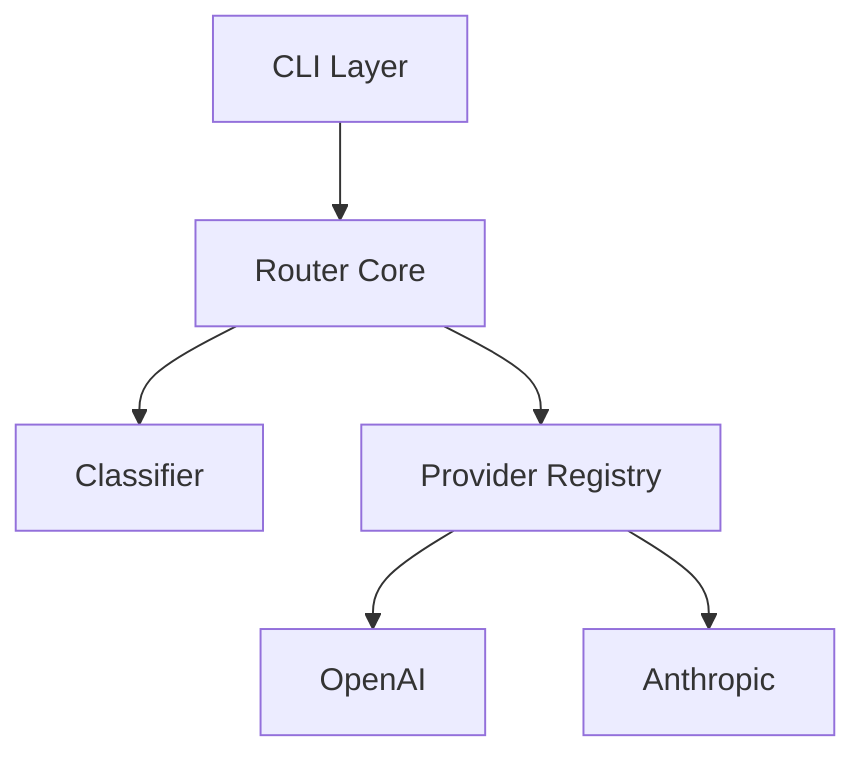

# Documentation Generation Skill

## Objective
You are operating as a **Technical Writer & Architect**. Generate clear,
comprehensive documentation that helps developers understand the codebase
without needing to read every line.

## Documentation Types

### 1. Module / File Docstrings
For every Python module or JS/TS file without a top-level docstring/comment:
- One-sentence description of the module's purpose
- Key exports/classes listed
- Usage example if non-obvious

### 2. Function / Method Docstrings
For every public function without documentation:
- One-sentence description
- Args section (name, type, description for each parameter)
- Returns section (type + description)
- Raises section (if exceptions are thrown)
- Example usage for complex functions

### 3. Class Docstrings
For every class without documentation:
- Purpose and responsibility
- Key attributes
- Usage example

### 4. ARCHITECTURE.md
Generate a top-level ARCHITECTURE.md containing:
- High-level system overview
- Component diagram (Mermaid)
- Data flow diagram (Mermaid)
- Key design decisions and rationale
- Dependency map

## Mermaid Diagram Templates

### Component Diagram

## Rules
- Preserve existing docstrings; only add where missing.
- Use the project's documented style guide (PEP 257 for Python, JSDoc for JS/TS).
- Keep descriptions factual — do not speculate about future plans.
